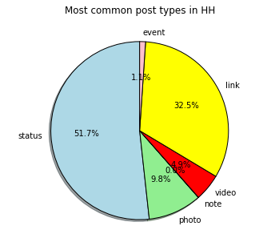
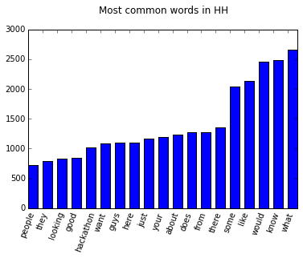

#HH Data

This is an IPython notebook analyzing some data extracted from [Sociograph](http://sociograph.io). Actual IPython in [HH data.ipynb](HH\ data.ipynb)

```python
%matplotlib inline
#Import files
import matplotlib.pyplot as plt
import numpy as np
import markovify
import facebook
from nltk.tokenize import sent_tokenize, word_tokenize
from config import *
graph = facebook.GraphAPI(access_token=token, version='2.2')
```


```python
#Populate list of posts
posts = []
labels = []
with open('posts.csv') as f:
    for i, a in enumerate(f.readlines()):
        if i == 0:
            labels = [l.replace('\n', '') for l in a.split(',')]
            print labels
        else:
            toapp = {}
            for i, b in enumerate(labels):
                toapp[b] = a.split(',')[i].replace('\n', '')
            posts.append(toapp)
```

    ['id', 'url', 'createdTime', 'likesCount', 'commentsCount', 'sharesCount', 'authorId', 'authorName', 'type']


```python
#Find the different types of posts
types = {}

for a in posts:
    if a['type'] not in types:
        types[a['type']] = 1
    else:
        types[a['type']] += 1

labels = []
sizes = []
colors = ['lightblue','lightgreen','white','red','yellow','pink']
for key, val in types.iteritems():
    labels.append(key)
    sizes.append(val)
    
plt.pie(sizes,labels=labels, colors=colors, autopct='%1.1f%%', shadow=True, startangle=90)
plt.axis('equal')
plt.title("Most common post types in HH\n\n")
plt.show()
```





```python
#Get all posts and write to file
graph = facebook.GraphAPI(token)
text = ""
postinfo = []
for a in posts:
    if a['type'] == 'status':
        try:
            pinfo = graph.get_object(a['url'].split('/')[-1])
            postinfo.append(pinfo)
            f = open('posts', 'a')
            f.write(str(pinfo)+'\n')
        except:
            print 'Error not found'
print postinfo[0]
lines = []
with open('posts') as f:
    lines = f.readlines()
postinfo = []
for a in lines:
    toappend = a.replace(" u'", "'").replace(' u"', '"').replace('{u', '{').split(':')[4:-1]
    if len(toappend) > 0:
        postinfo.append(toappend[0][1:-5])
tokenized_words = [word_tokenize(i) for i in postinfo]

commonwords = []
indices = []
for a in tokenized_words:
    if len(a) > 0:
        for b in a:
            b = b.lower()
            if len(b) > 3:
                if b[-1] != '\\':
                    b.decode('string_escape')
                if b not in commonwords:
                    commonwords.append(b)
                    indices.append(1)
                else:
                    indices[commonwords.index(b)] += 1
def bubbleSort(indices, words):
    for passnum in range(len(indices)-1,0,-1):
        for i in range(passnum):
            if indices[i]>indices[i+1]:
                temp = indices[i]
                tempwords = words[i]
                indices[i] = indices[i+1]
                words[i] = words[i+1]
                indices[i+1] = temp
                words[i+1] = tempwords
                
bubbleSort(indices, commonwords)
```


```python
#Get top twenty words from posts
y = indices[-20:-1]
N = len(y)
plt.xticks( range(len(y)), tuple(commonwords[:-4][-20:-1]), rotation=70 )
x = range(N)
width = 1/1.5
plt.bar(x, y, width, color="blue")
plt.title("Most common words in HH\n")
plt.show()

```





```python
#Generate posts that simulate HH :)
text_model = markovify.Text('. '.join(postinfo))
for i in range(5):
    print(text_model.make_sentence()+'\n')
```

    I really want to also play viola and am using Bootstrap for the offices and how challenging was it and can link?
    
    What are the specific languages that would work with khan academy.
    
    I remember seeing a post somewhere, where are all tech people, so can I begin with?'.
    
    Ironically this photo was taken on the Chrome Extension that will define the future.
    
    \n\nThanks for the Amazon site.
    


```python

```
